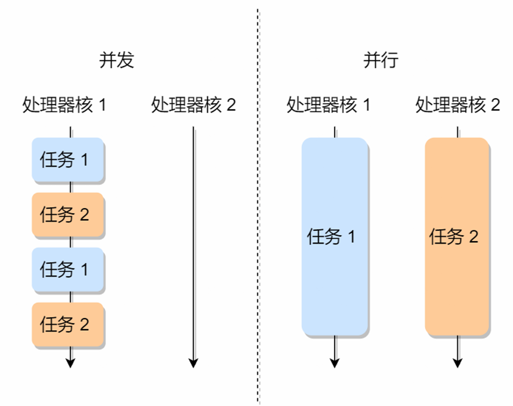

# 进程与线程

## 1. 进程基础
### 1.1 进程的概念
> 我们编写的代码只是⼀个存储在硬盘的静态⽂件，通过编译后就会⽣成⼆进制可执⾏⽂件，当我们**运⾏这个可执⾏⽂件后，它会被装载到内存**中，接着 CPU 会执⾏程序中的每⼀条指令，那么这个运⾏中的程序，就被称为「进程」（Process）。
* 定义：具有独⽴功能的程序在⼀个数据集合上**运⾏的过程**；系统进⾏**资源分配和调度的⼀个独⽴单位**。
    * 每个进程有独立的虚拟空间
    * 进程映像：程序段+数据段+PCB

### 1.2 进程控制块PCB
PCB是**进程存在的唯一标识，常驻内存**；进程创建时建立PCB，进程结束后删除。包括以下信息：
1. 进程描述信息：进程标识符、用户标识符
2. 进程控制和管理信息：进程当前状态、进程优先级
3. 进程资源分配清单：有关内存地址空间、虚拟地址空间的信息；所打开的文件列表；所使用的IO设备信息
4. CPU相关信息：**进程切换时，CPU寄存器的值都被保存在相应PCB中，以便CPU重新执⾏该进程时能从断点处继续执⾏**（用于恢复进程上下文）
    * CPU寄存器的值有:通用寄存器、程序寄存器、程序状态字
    * 堆:动态分配的内存空间
    * 栈:上下文信息;函数调用时的形参,局部变量

PCB通常通过**链表**组织,把具有**相同状态的链表,组织成队列**.

### 1.3 并发与并行
* 并发:单个处理核,交替执行多个进程(切换前,需要记录当前进程中运行的状态信息,以备下次恢复执行)
* 并行:多个处理核同时执行多个进程

### 1.4 进程的状态切换
